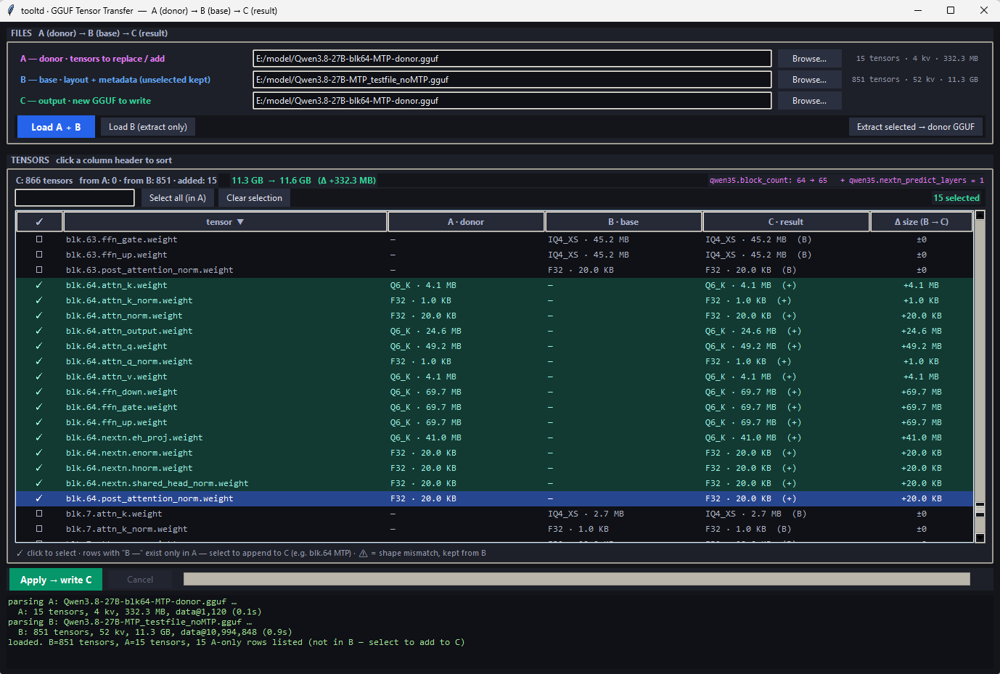

# GGUF Tensor Transfer

A Windows GUI tool for surgical tensor transfer between GGUF files: pick a
**donor** (A), a **base** (B), and produce a new file **C** where the tensors
you selected are taken from A while everything else stays from B — streamed
straight to disk without loading tensors into RAM.

Built for the Qwen3.5/Qwen3.6 **MTP** workflow (grafting an `blk.64`
nextn block between quantized models), but works with any GGUF pair that
shares the same architecture.



## What it does

For every tensor in B, the table shows where C will get it from:

| ✓ | tensor | A · donor | B · base | C · result | Δ size (B → C) |
|---|--------|-----------|----------|------------|----------------|
| ☐ | blk.0.attn_q.weight | Q4_K · 78.6 MB | IQ2_S · 31.4 MB | Q4_K · 78.6 MB  | +47.2 MB |
| ☐ | blk.64.attn_q.weight | Q4_K · … | — | Q4_K · …  (+) | +… |

- Click the **✓** column to select/deselect tensors; click column headers to
  sort; the search box filters by name.
- Tensors that exist **only in A** (e.g. an MTP block `blk.64` missing from B)
  are listed after the B rows; select them to **append** them to C.
- A live summary bar shows the C tensor count, source mix
  (`from A · from B · added`), size before → after, and the metadata (KV)
  patches that will be applied.

### Metadata handling (MTP)

When donor-only tensors are appended, the structural KVs are synced into C:
`{arch}.block_count` is raised and `{arch}.nextn_predict_layers` is patched
in place (or appended when absent). llama.cpp requires **both** KVs to
activate the MTP (`n_layer_nextn`) layer.

### Extract selected → donor GGUF

Use **Load B (extract only)** to load just the base file, select tensors,
and export them to a small standalone donor GGUF — handy for carving out an
MTP block (`blk.64`) or any tensor group from a big model. The donor carries
the `block_count` / `nextn_predict_layers` KVs so it can drive a later
transfer automatically.

## Requirements

- Windows, Python 3.10+ (tkinter is included in the standard installer)
- `pip install -r requirements.txt` — only the
  [`gguf`](https://pypi.org/project/gguf/) metadata package

## Usage

```
python gguf_transfer_gui.py
```

1. Pick **A** (donor) and **B** (base) → **Load A + B**.
   Nothing is pre-selected — pick your tensors manually.
2. Select tensors: click the ✓ column, or use **Select all (in A)** /
   **Clear selection**.
3. Set the **C** output path → **Apply → write C**.
   - The Apply button disables while writing; **Cancel** aborts and removes
     the partial file.
   - The progress bar ticks in ~32 MB steps with a live MB/s readout.
   - After the write, a quick verification runs automatically (tensor count,
     total size, 1 KB spot check of every donor-sourced tensor).

Files are streamed in 256 MB chunks through a two-thread pipeline, so a
~12 GB transfer peaks at only a few hundred MB of RAM.

## Layout of C

- C keeps **B's tensor order**; appended donor tensors come after.
- A selected tensor is taken from A only when its dimensions match B's;
  otherwise the B copy is kept and a ⚠ warning is shown.
- Data is copied byte-exact as contiguous spans — no re-quantization, no
  data rewriting. C size ≈ B size + size of appended/changed tensors.

## Files

| File | Role |
|------|------|
| `gguf_transfer_gui.py` | GUI + plan/write/verify core (core is importable, GUI-free) |
| `_gguf_fast.py` | Minimal streaming GGUF header parser/builder (stdlib only) |

## Notes

- Output C must be a different path from A and B.
- On a mechanical HDD, transfer speed is bounded by the drive
  (~50–150 MB/s depending on fragmentation); the GUI only reports it.
